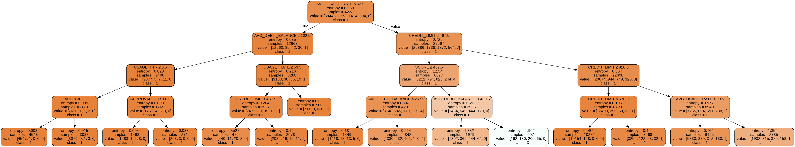
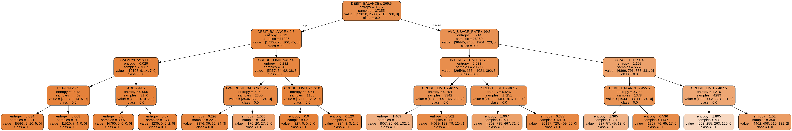

# Decision_Tree_Testing

| **Title**      | Decision Tree: Tìm nguyên nhân khách hàng bị nợ xấu|
| ---------- |-------------------|
| **Team**       | Nguyễn Phước Tân <nptan2005@gmail.com>, Tiết Hán Cường <cuongth3650@gmail.com>|
| **Predicting** | Mục tiêu tìm nguyên nhân những khách hàng vay tín dụng bị nhảy nhóm nợ. Từ đó đưa ra chính sách thay đổi để giảm thiểu khách hàng nợ xấu|
| **Data**       | Dữ liệu giả lặp về thông tin khách hàng bao gồm: Mã khách hàng và các tham số liên quan như: tuổi, ngày đáo hạn, ngày khách hàng nhận lương, nghề nghiệp, loại hình sản phẩm, tỉnh thành cư trú, hạn mức, dư nợ ($ dolar), tỷ lệ sử dụng, tỷ lệ sử dụng bình quân,.. **(dữ liệu là giả lặp nhưng được random dựa trên 1 số trọng số thực tế như tỷ lệ nợ trên 1 nhóm khách hàng)**|
| **Features**   |1. Ngày đáo hạn và ngày nhận lương: nhận thấy rằng nếu ngày nhận lương quá xa ngày đáo hạn, có thể khách hàng sẽ không còn đủ tiền trả nợ|
|                |2.ỷ lệ sử dụng bình quân (dư nợ bình quân/hạn mức được cấp): nhận thấy rằng khách hàng có tỷ lệ lớn, dư nợ kéo dài và ít có chiều hướng giảm => khả năng khách hàng này mất khả năng chi trả trong tương lai|
|                |3.Tuổi: xét về tuổi lao động khách hàng|
|                |4.Thu nhận năm: xét về thu nhập khách hàng so với khoảng nợ đang vay|
| **Models**     | DecisionTreeClassifier và RandomForestClassifier, so sánh kết quả của 2 model|
| **Results**    | 1.|
|.               | 2. |
| **Discussion** | Kết quả mong đợi: thuật toán sẽ cho ra Feature 1 (Ngày đáo hạn và ngày nhận lương) vì đây là Feature có thể thay đổi. Nhưng kết quả cho ra tỷ lệ bình quân sử dụng và dư nợ |
| **Future**     ||
|**References**  ||

